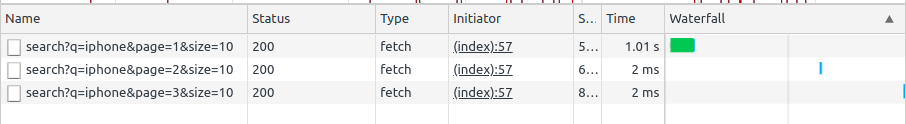

# KraickList

## Improvement

1. Pagination

Pagination helps us to limit the total search result shown to the user at a time. This makes the API data transfer become faster because it loads fewer item at a time.

   

2. Fuzzy search

The odds of user will type wrong word or mixed case is inevitable. Instead of stopping the user experience by returning error, it would be better if the search engine use fuzzy search method to search the item, so that results with closer match will appear to the user.

3. Simple cache on the pagination result

Assuming the user use the pagination button, the results array on the server would be the same as previous. To save us time on the searching, I apply simple caching mechanism. This can be improved by using Redis or other caching service to make our API instance stay stateless.

---
Welcome to Haraj take home challenge!

In this repository you will find simple web app for fictional startup called KraickList. This app will allow users to search ads from given sample data located in `data.gz`.

Currently the app is just rough prototype. The search is case sensitive, limited to exact matches, & the search result is pretty much could be further improved.

You could see the live version of this app [here](https://gentle-forest-97151.herokuapp.com/). Try searching for "iPhone" to see some results.

## Your Mission

Improve the overall app. Think about the problem from user perspective and prioritize your changes according to what you think is most useful.

## Evalution

We will evaluate your submission based on:

1. The approach you are using to identify & solve the problems
2. The quality of your search result
3. The design & testability of your code
4. The method you are using to deploy your app

## Submission

1. Fork this repository and share us the link to your fork after pushing the changes.
2. Host your solution. This project includes Heroku Procfile and in its current state can be deployed easily on free tier. You could also host the app on your own server. Share us the link to your solution.
3. In your submission, share with us what changes you have made and what further changes you would prioritize if you had more time.

## About Sample Data

The data is translated from Arabic to English using Google Translate, so sometimes you will find funny translation on it. 🤣
